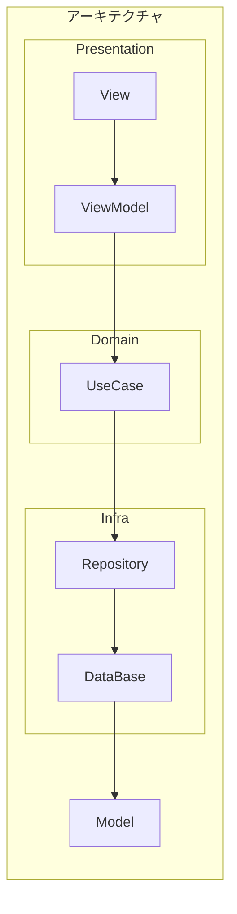

# Kyaracter

This application is "Kyaracter", a mini game for Playing & Learning a character with sound, but now in development.

## Skills
- Kotlin Multiplatform Mobile
- Single Activity
- Navigation Component
- MVVM + UseCase
- SharedFlow
- Coroutine
- Multiplatform-Settings
- kotlinx.serialization
- MediaPlayer

## アーキテクチャ

